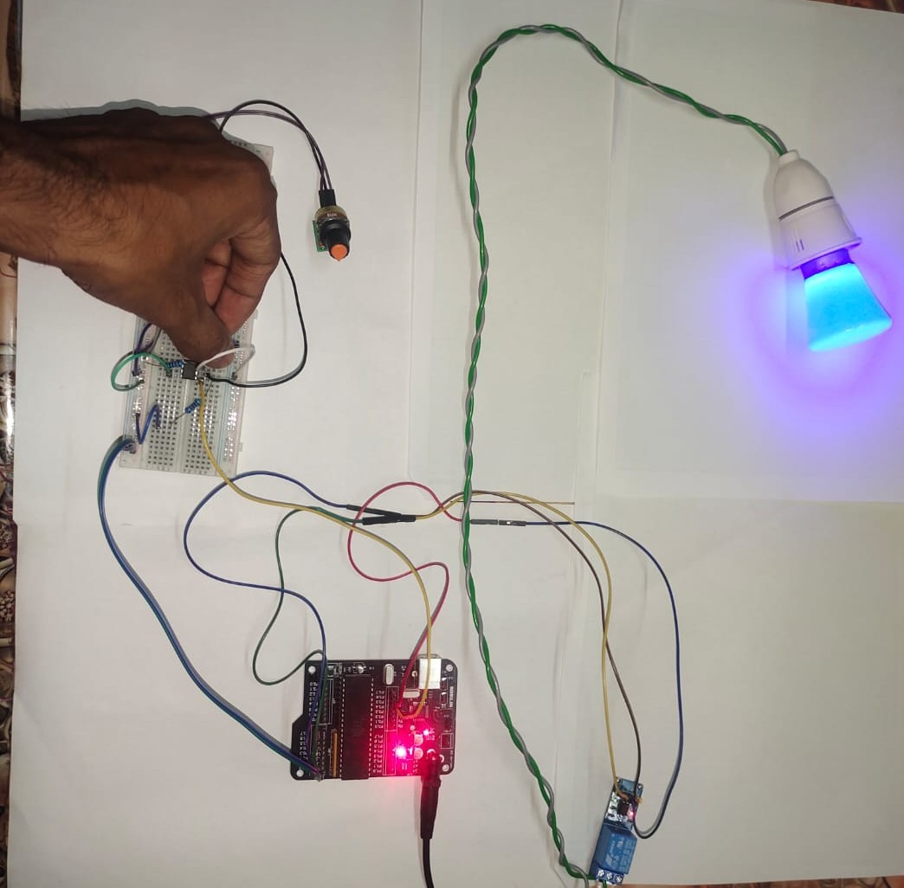
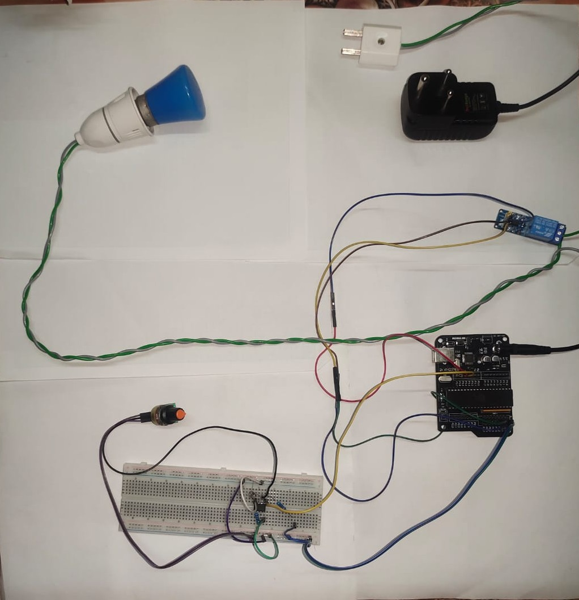
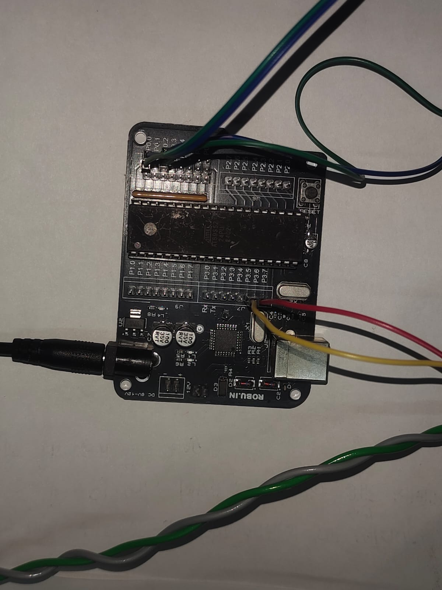
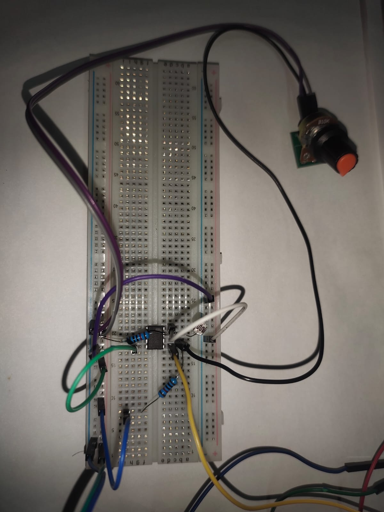
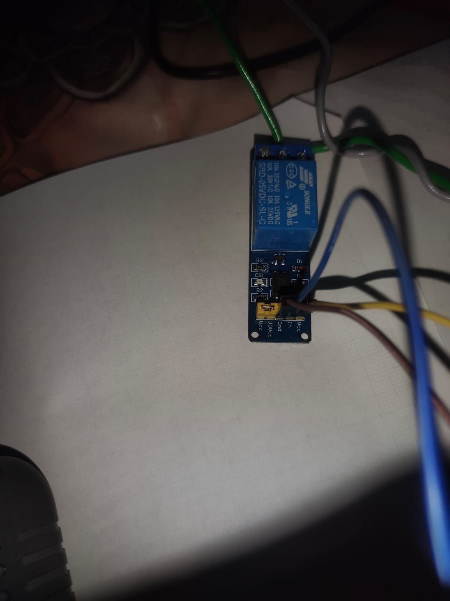
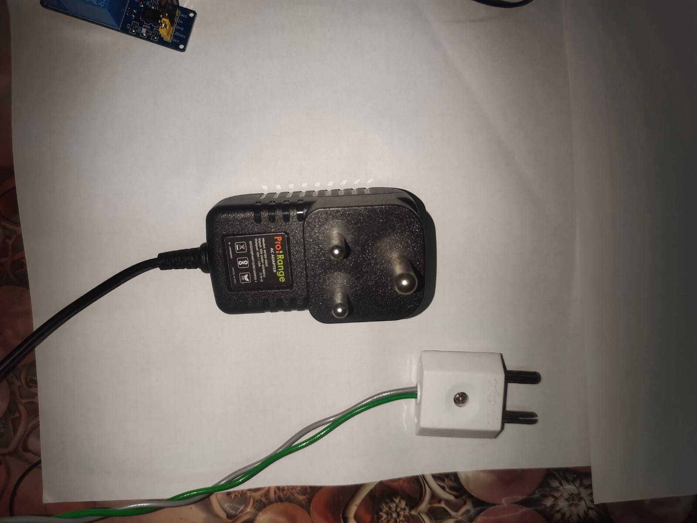
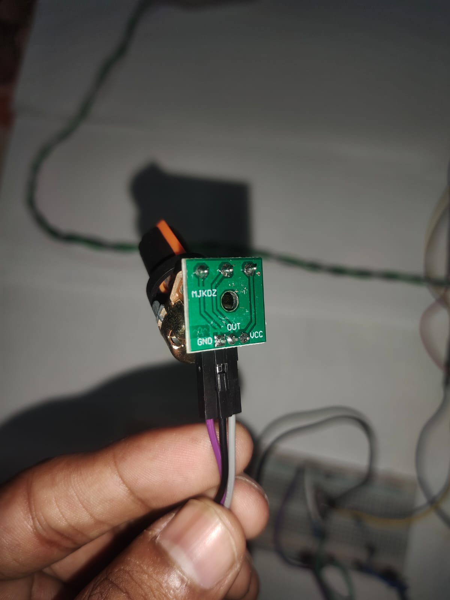

# 💡 8051 Smart AC Light Controller  
### Energy Management System using AT89S52

---

## 🎥 Project Demo

---

## 🌍 Problem Statement

A significant amount of electrical energy is wasted globally due to lights (streetlights, corridors, outdoor lighting) remaining ON during daylight hours. Manual switching is:

- ❌ Unreliable  
- ❌ Labor-intensive  
- ❌ Costly (higher electricity bills)  
- ❌ Environmentally harmful  

---

## ✅ Proposed Solution

This project implements an **Autonomous Dusk-to-Dawn Lighting System** using an **8051 microcontroller (AT89S52)**.

The system:
- Automatically turns OFF lights during daytime  
- Automatically turns ON lights at night  
- Eliminates manual intervention  
- Reduces energy consumption and cost  

---

## 🚀 Project Overview

This embedded system uses:
- A custom analog light sensing circuit  
- LM393 voltage comparator  
- LDR (Light Dependent Resistor)  

The microcontroller continuously monitors ambient light levels and controls a **220V AC bulb using a relay module**.

---

## 📸 Project Images

### 🔹 Final Prototype

### 🔹 8051 Development Board

### 🔹 LDR Sensor Setup

### 🔹 Relay Module

### 🔹 Power Adapter

### 🔹 Potentiometer

---

## 🧠 Core Concept

### Comparator-Based Light Detection

- LDR senses ambient light  
- Potentiometer sets threshold  
- LM393 compares voltages  
- Output is sent to the 8051 microcontroller  

---

## 🔌 Hardware Components

- AT89S52 (8051) Development Board  
- LM393 Voltage Comparator  
- LDR (Light Dependent Resistor)  
- 2 × 10kΩ Resistors  
- 3-Pin Potentiometer  
- 5V Relay Module (Active-Low)  
- 220V AC Bulb and Holder  
- Breadboard & Jumper Wires  
- 5V Power Supply  

---

## 🔧 Circuit Connections

### 🟢 Low Voltage (5V DC)

#### LM393 Comparator

| Pin | Connection |
|-----|-----------|
| Pin 8 | +5V |
| Pin 4 | GND |
| Pin 3 (IN+) | LDR + Resistor junction |
| Pin 2 (IN-) | Potentiometer output |
| Pin 1 (OUT) | P2.5 (via 10k pull-up) |

#### Relay Module

| Pin | Connection |
|-----|-----------|
| VCC | +5V |
| GND | GND |
| IN  | P2.6 |

---

### 🔴 High Voltage (220V AC)

⚠️ **WARNING: Handle with extreme caution**

- Live (Green) Cut in the middle
- From plug part → Relay COMMON Terminal
- Relay NORMALLY OPEN TERMINAL → towards Bulb part 
- Neutral → Keep as it is 

---

## 🧠 Engineering Highlight

### Open-Collector Output (LM393)

- Can pull LOW (0V)  
- Cannot generate HIGH (5V)  

👉 Solution: Use a **10kΩ pull-up resistor**

| Condition | Output |
|----------|--------|
| Dark     | HIGH (5V) |
| Bright   | LOW (0V) |

---

## ⚡ Working Principle

1. LDR detects ambient light  
2. Comparator compares it with threshold  
3. Output sent to 8051  
4. Microcontroller drives relay  

| Condition | Relay Input | Bulb |
|----------|------------|------|
| Dark     | LOW        | ON   |
| Bright   | HIGH       | OFF  |

---

## 💻 Firmware

- Written in Embedded C  
- Compiled using Keil uVision  

### 🔑 Features

- Debounce delay to prevent relay chatter  
- Stable switching  
- Noise immunity  

---

## 🌐 Applications

- Smart Street Lighting  
- Home Automation & Security  
- Greenhouse Light Control  
- Industrial Lighting Systems  

---

## 📈 Future Improvements

- IoT integration (ESP32/WiFi)  
- Solar power integration  
- Adaptive brightness control  
- Motion detection  

---

## ⚠️ Safety Precautions

- Disconnect AC supply before wiring  
- Use insulated wires  
- Avoid touching relay when powered  
- Use proper casing for deployment  

---

## 👨‍💻 Author

**Rohit Singh**  
B.Tech ECE | Embedded Systems & VLSI  

---

## ⭐ Support

If you found this useful:

- ⭐ Star the repository  
- 🍴 Fork it  
- 🤝 Contribute

---

## 📜 License

This project is licensed under the MIT License.
